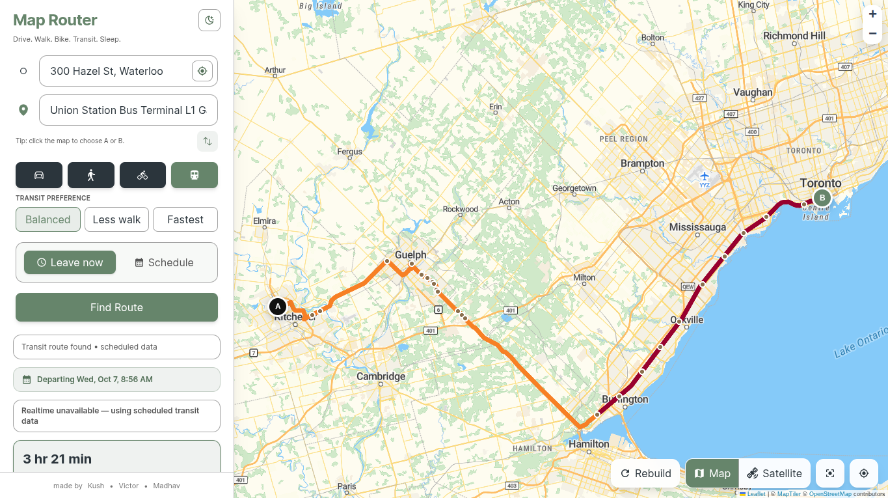
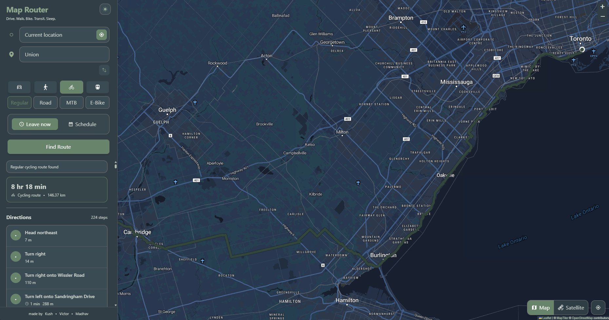
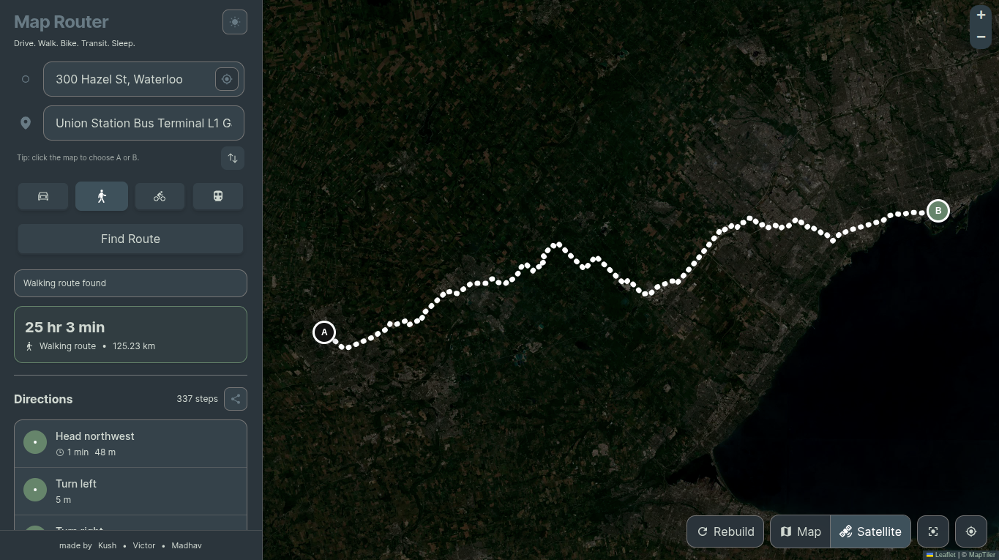
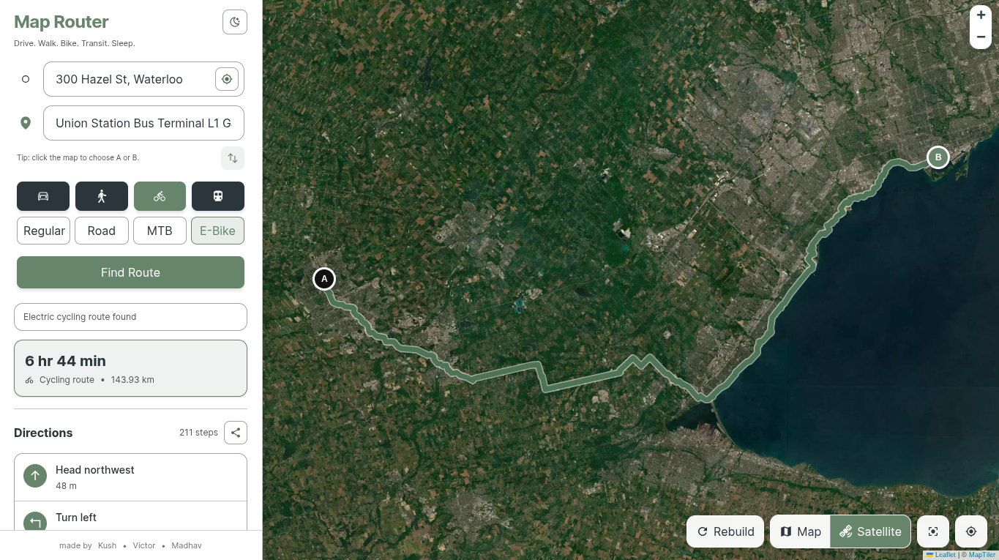
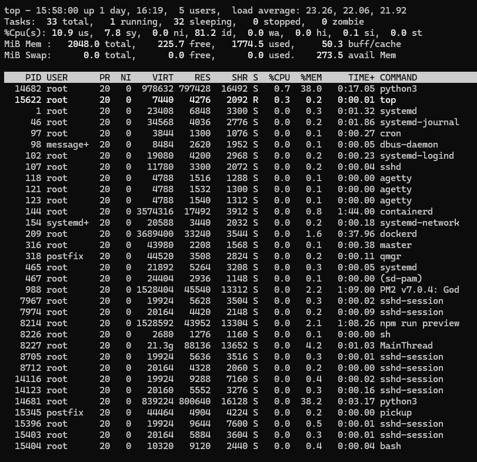
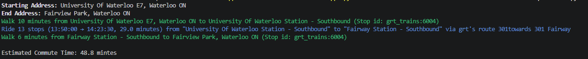

<h1 align="center"><a href=https://map.host-transit-page.hackclub.app> MAP </a></h1>

#### [MAP](https://map.host-transit-page.hackclub.app/) is a student-made open source routing software, and it's still under development. All feedback is always welcome. Feel free to send it to [host-transit-page@user.hackclub.app](mailto:host-transit-page@user.hackclub.app)

#### Street view: 

↑↑ Light Mode ↑↑ | | | ↓↓ Dark Mode ↓↓

#### Satellite: 

↑↑ Dark Mode (Satellite) ↑↑ | | | ↓↓ Light Mode (Satellite) ↓↓

##### more views incoming...

## Running / Using [MAP](https://map.host-transit-page.hackclub.app/)

<h4><strong> <a href=https://map.host-transit-page.hackclub.app> MAP </a> is now hosted at <a href=https://map.host-transit-page.hackclub.app/)>this URL! </a></strong></h4>

If you'd rather copy and paste it, it's [https://map.host-transit-page.hackclub.app/](https://map.host-transit-page.hackclub.app/)\
(A new URL may be incoming!)

MAP is now back on Vercel! It can be accessed with [here](https://map-thirdspace.vercel.app/).

If you'd rather compile it and run it yourself, locally, that too is quite simple, however it does prerequisite `vite` and `npm`. If you don't have them installed, now's a great time to get them.

In fact, MAP is designed to be able to run fully offline for transit routing! (Alas, some features such as real time GTFS would not be possible). The local A* algorithm will work normally and do its routing job! However, if the address is not in the Region Of Waterloo's Address Lookup, then you will have to put the location into `transit_data/geocode_cache.json`. (Only for offline operation, as the geocoding falls back to online servers otherwise.)

To run [MAP](https://map.host-transit-page.hackclub.app/) locally, follow the following (quite simple) steps!

1. **Optional:** Fork [the MAP repository](https://github.com/kus001/map). Forking the repository creates your own version of the files, allowing you to modify and edit the open source files however you so desire, and also the ability to share your own version! Forking also allows you to make pull requests, which are a way of contributing back to the main repository. By doing so you help make open source software even better!

2. Next, **clone the repository**. Cloning the newly made repository permits you to have your own version of [our repository](https://github.com/kus001/map) downloaded locally onto your computer! Please note that where you type the following in will be where the new folder is made.

   - If you forked the repository first, run `git clone <your-repository-url>`.
   - If you did *not* fork [our repository](https://github.com/kus001/map),
all you have to do is **run the following** `git clone https://github.com/kus001/map`

3. Next, you must change your [working directory](https://en.wikipedia.org/wiki/Working_directory) to the one in which you cloned/downloaded the files. This is the one that we can't really help you with, but it will be wherever you ran the previous command. 

    - For example on windows if you ran this in `C:\Users\YourName\Documents\Github`, then you'll likely want to run `cd C:\Users\YourName\Documents\Github\map`

4. Next, once you are into your local version of your repo, run `cd frontend && npm install`. The first part will move you into the frontend repo where all the website code resides, while the second part will install the dependancies of the code.

6. After that, you'll want to run the project via `npm run dev`. You can run `npm run dev -- --host` to make it discoverable to other computers on the network!

7. For the python script, you should install its dependancies by running `pip install -r requirements.txt` in the base folder (typically `map/`) (in a new terminal)

8. Finally, make sure you run `python3 main.py` or else your server will not function! The server uses ports 8080 and 5173.

9. That's it! If you'd like to host your own server, keep reading. Please note that this has only been tested on linux.

    1. Build: build the website by running `npm run build` in the `frontend` directory.

    2. Install PM2: `npm install pm2@latest -g`. PM2 allows you to host the server even when you have closed the terminal!
    
    3. Still in the `frontend` directory, run `pm2 start ecosystem.config.cjs --env production`. This will cause the server to run on port `:5173`.

    4. To keep the python script running in the background, run `nohup python3 main.py > output.log 2>&1 &` in the base directory where `main.py` resides.

    5. If you want to reload your server with our latest code, just run `chmod +x rebuild.sh` to give rebuild.sh perms, and then run `./rebuild.sh`. If you'd rather do it yourself, follow the following. Start in the base directory for this git repo. In this case, that's going to be `map/`. We assume that this is already running, and you just want to rebuild with the latest code. It will also be assumed that the amount of RAM available is very limited. If that is not the case, ignore steps 1 and 2.

        1. Run `top -o %MEM`. This will allow you to find the `python3` process running, to kill it and provide enough RAM for the building.

        

        2. In this case, you want to kill `14682`. Do this by running `kill 14682`.

        3. After that, pull the new code with `git pull`. If this fails, you will likely have to fix up `frontent/geocode_cache.json`, as it may have populated with things as your server has run. If you are ok with getting rid of any local changes, then you can just run `git restore transit_data/geocode_cache.json && git pull`

        4. Next, you'd like to build and redeploy the code. Do this by running `cd frontend/ && npm run build && pm2 restart all && cd ..`

        5. Restart `main.py` by running `nohup python3 main.py > output.log 2>&1 &`.

        6. **If you'd like a one liner:** Just run `git restore transit_data/geocode_cache.json || git pull && git pull && cd frontend/ && npm run build && pm2 restart all && cd ..`.
            - If you stopped `main.py` earlier, also run `nohup python3 main.py > output.log 2>&1 &` in the base folder. Note that this will destroy your local cache of places.

            - If PM2 wasn't already started, then just run `cd frontend/ && pm2 start ecosystem.config.cjs --env production && cd ..` first.

### TRANSIT

The transit router residing in `transit.py` has now been updated to have a full user-interface combined with accurate transfers! The router uses a homegrown version of the [A*](https://en.wikipedia.org/wiki/A*_search_algorithm) (Pronounced A Star) search algorithm! The graph now contains appropriate details to route concious of the current date and current time, and find the route that will, in the following order of priority,

1. Arrive the earliest
2. Depart the latest
3. Have the least amount of transfers.

~~However, the transit system *does not* (yet) provide walking instructions to the and in between stops. That should be added at some point soon.~~
~~Here's a sample output!~~

That's all old! Everything should work now!! It should be integrated into the website!

## NOTES

<h3 style="display: inline;"> Running transit.py </h3>

It is recommended to run this project in its own folder so you can easily delete any spawned files. The project generates the transit_data folder when running `transit.py`.

<h3 style="display: inline;">Speed Limitation on transit.py</h3>

~~Additionally, since the transit router is written in Python and uses a relatively brute-forced approach, long distance commuting can be very, very slow to calculate. Althought the base A* algorithm is quite fast, there is an additional step on top of it slowing it down quite a bit, the step being searching 900 times, from the 30 closest stops to you and the 30 closest stops to the destination. A speed update will be coming soon, as currently the system uses just brute force, but the A* algorithm's graph could likely be updated to include the additional edges with the 30 closest stops being attached to the starting stop, allowing the A* algorithm to not have to search the same stop so many times (And not have to be run 900 times!)~~

FIXED!! Algorithm now runs really quickly, and only once! However, for long distances it can still be quite slow ... even then that's most likely just a server side problem, very usable as an end user.

<h3 style="display: inline;">AI</h3>

In general, there was AI usage for this project, however the majority of it was used to debug code after already having spent a lot of time on it. There was also quite a bit of code refinement and comments being added, done by AI. Occasionally, such as with the local geocoding, the feature would be started with AI help then mostly done by hand.

### $$\color{red}\text{Made with <3 by @kus001, @roc-ket-cod-er and @BigBrain244466666}$$

